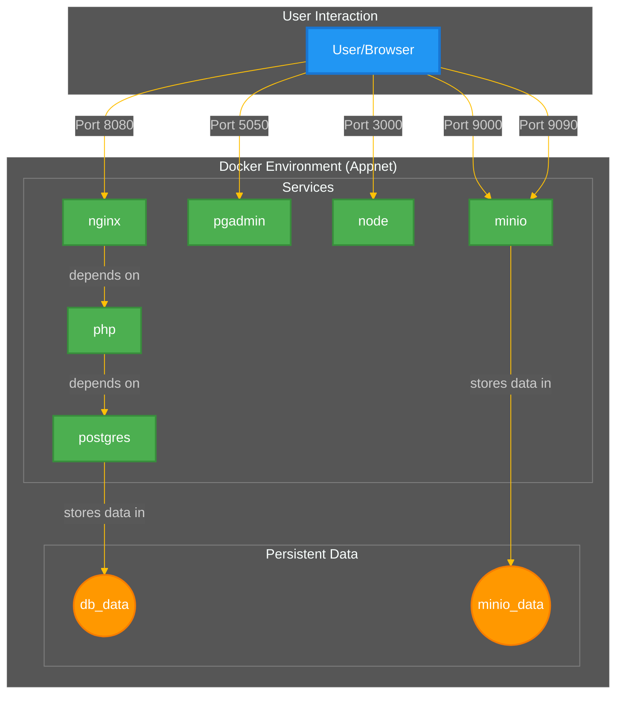
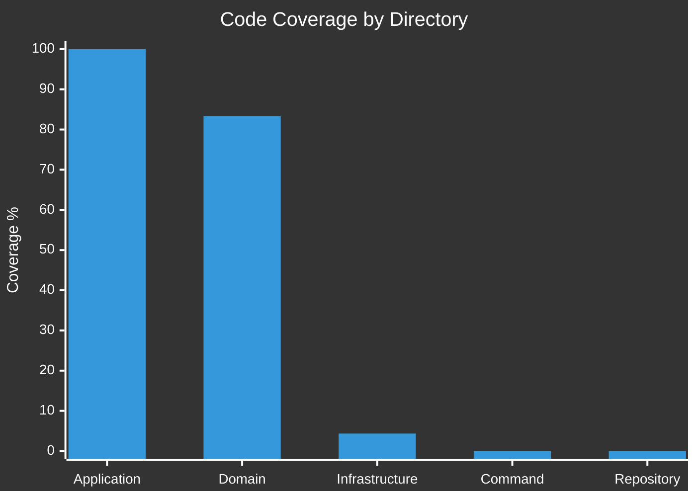

~~# My Symfony Project

> **Note:** This README.md is automatically generated. To make changes, please edit the `README.template.md` file and then run the `./generate-readme.sh` script.

---

## 🏛️ System Architecture

The following diagram represents our Docker environment. It is generated directly from the `docker-compose.yml` file to ensure it is always up-to-date with our infrastructure.



---

## 🧪 Code Quality & Test Coverage

This summary shows the current state of our PHPUnit test coverage. The report is generated automatically after each test run.



---

## 🚀 Getting Started

Follow these steps to get the project up and running on your local machine.

1.  **Clone the Repository**
    ```bash
    git clone <your-repository-url>
    cd <your-project-directory>
    ```

2.  **Build and Start Services**
    ```bash
    docker-compose up -d --build
    ```

3.  **Install Dependencies**
    ```bash
    docker-compose exec php composer install
    ```

4.  **Run Database Migrations**
    ```bash
    docker-compose exec php php bin/console doctrine:migrations:migrate
    ```

The application should now be available at `http://localhost:8080`.

## ⚙️ Available Commands

-   **Generate this README:**
    ```bash
    ./generate-readme.sh
    ```
-   **Run Tests:**
    ```bash
    docker-compose exec php php bin/phpunit
    ```~~
