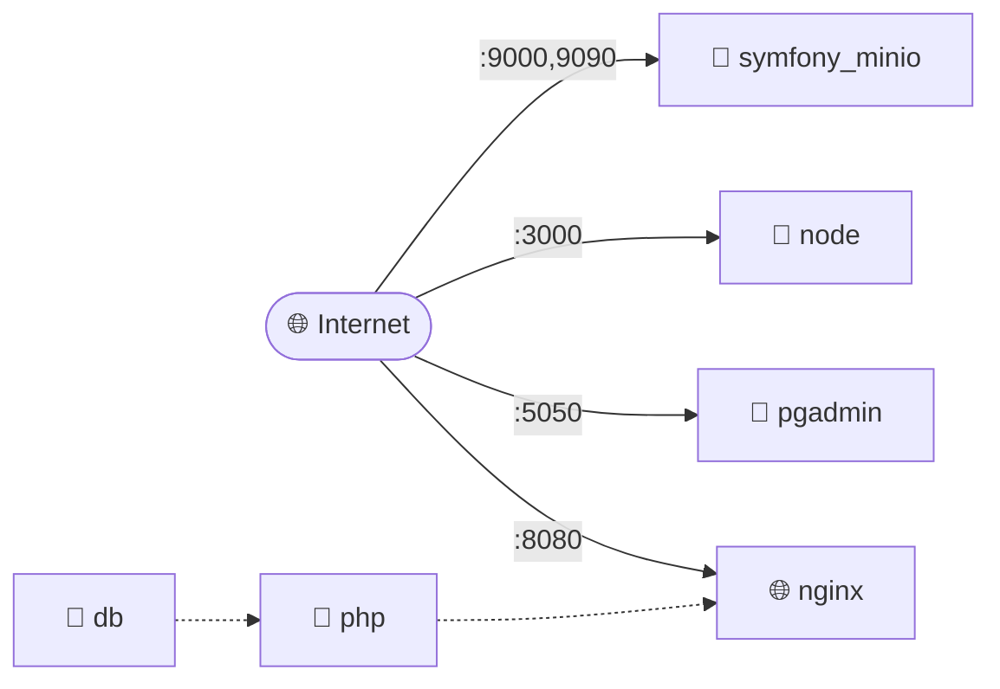

# Docker Environment Diagram

Generated on: 2025-08-21 17:01:43
Diagram type: Network

## Environment Overview

- **Services**: 6
- **Volumes**: 2
- **Networks**: 1

## Services

### 🐘 php
- **Image**: `custom build`

### 🌐 nginx
- **Image**: `nginx:1.25`
- **Ports**: 8080

### 🐘 db
- **Image**: `postgres:15`

### 🐳 pgadmin
- **Image**: `dpage/pgadmin4`
- **Ports**: 5050

### 💚 node
- **Image**: `custom build`
- **Ports**: 3000

### 🐳 symfony_minio
- **Image**: `quay.io/minio/minio`
- **Ports**: 9000, 9090

## network Diagram

