# 🏗️ Project Structure Diagram

📅 **Generated on**: 2025-08-22 18:09:31
🎨 **Styled with**: Modern Dark Theme

## 📊 Project Statistics

| Metric | Value |
|--------|-------|
| 📁 **Total Directories** | 42 |
| 📄 **Total Files** | 0 |

## 🎯 Structure Diagram

> **Note**: This diagram uses a modern dark theme with enhanced visual elements.
> Icons and colors help identify different types of directories and files.

```mermaid
%%{init: {
  'theme': 'dark',
  'themeVariables': {
    'primaryColor': '#4CAF50',
    'primaryTextColor': '#ffffff',
    'primaryBorderColor': '#388E3C',
    'lineColor': '#FFC107',
    'secondaryColor': '#2196F3',
    'tertiaryColor': '#FF5722',
    'background': '#1a1a1a',
    'mainBkg': '#2d2d2d',
    'secondBkg': '#3d3d3d',
    'tertiaryBkg': '#4d4d4d'
  }
}}%%
graph TD

    root0["🏠 Project Root<br/>📊 Structure Overview"]
    dir1["⚡ bin"]
    root0 -.-> dir1
    dir2["⚙️ config<br/>⚙️ Configuration"]
    root0 --> dir2
    dir3["📂 packages"]
    dir2 -.-> dir3
    dir4["📂 test"]
    dir3 -.-> dir4
    dir5["📂 routes"]
    dir2 -.-> dir5
    dir6["📂 coverage"]
    root0 -.-> dir6
    dir7["📂 docker"]
    root0 -.-> dir7
    dir8["📂 minio_data"]
    root0 -.-> dir8
    dir9["🌐 public<br/>🌐 Web Assets"]
    root0 -.-> dir9
    dir10["🔧 src<br/>🔧 Application Code"]
    root0 ==> dir10
    dir11["📂 Application"]
    dir10 -.-> dir11
    dir12["📂 DTO"]
    dir11 -.-> dir12
    dir13["🔧 Service<br/>🔧 Business Logic"]
    dir11 ==> dir13
    dir14["📂 UseCase"]
    dir11 -.-> dir14
    dir15["📂 Domain"]
    dir10 -.-> dir15
    dir16["🏛️ Entity<br/>🏛️ Data Models"]
    dir15 ==> dir16
    dir17["📂 Port"]
    dir15 -.-> dir17
    dir18["🔧 Service<br/>🔧 Business Logic"]
    dir15 ==> dir18
    dir19["📂 Util"]
    dir15 -.-> dir19
    dir20["📂 Infrastructure"]
    dir10 -.-> dir20
    dir21["📂 Adapter"]
    dir20 -.-> dir21
    dir22["📂 Config"]
    dir21 -.-> dir22
    dir23["📂 Console"]
    dir21 -.-> dir23
    dir24["👂 EventListener"]
    dir21 -.-> dir24
    dir25["📂 FileStorage"]
    dir21 -.-> dir25
    dir26["📂 Http"]
    dir21 -.-> dir26
    dir27["📂 Messaging"]
    dir21 -.-> dir27
    dir28["📂 Persistence"]
    dir21 -.-> dir28
    dir29["🗃️ Repository<br/>🗃️ Data Access"]
    dir10 ==> dir29
    dir30["🧪 tests<br/>🧪 Test Suite"]
    root0 -.-> dir30
    dir31["📂 App"]
    dir30 -.-> dir31
    dir32["📂 Functional"]
    dir31 -.-> dir32
    dir33["🎮 Controller<br/>🎮 HTTP Handlers"]
    dir32 ==> dir33
    dir34["📂 Integration"]
    dir31 -.-> dir34
    dir35["📂 Api"]
    dir34 -.-> dir35
    dir36["🗃️ Repository<br/>🗃️ Data Access"]
    dir34 ==> dir36
    dir37["📂 Unit"]
    dir31 -.-> dir37
    dir38["📂 Application"]
    dir37 -.-> dir38
    dir39["📂 Domain"]
    dir37 -.-> dir39
    dir40["📁 var"]
    root0 -.-> dir40
    dir41["📂 coverage"]
    dir40 -.-> dir41
    dir42["📂 storage"]
    dir40 -.-> dir42

    %% Enhanced Styling
    classDef rootNode fill:#4CAF50,stroke:#388E3C,stroke-width:4px,color:#fff,font-weight:bold
    classDef srcNode fill:#2196F3,stroke:#1976D2,stroke-width:3px,color:#fff
    classDef configNode fill:#FF9800,stroke:#F57C00,stroke-width:2px,color:#fff
    classDef templateNode fill:#9C27B0,stroke:#7B1FA2,stroke-width:2px,color:#fff
    classDef testNode fill:#FF5722,stroke:#D84315,stroke-width:2px,color:#fff
    classDef publicNode fill:#4CAF50,stroke:#388E3C,stroke-width:2px,color:#fff
    classDef directoryNode fill:#607D8B,stroke:#455A64,stroke-width:2px,color:#fff
    classDef fileNode fill:#795548,stroke:#5D4037,stroke-width:1px,color:#fff
    class root0 rootNode
    class dir1 directoryNode
    class dir2 configNode
    class dir3 directoryNode
    class dir4 directoryNode
    class dir5 directoryNode
    class dir6 directoryNode
    class dir7 directoryNode
    class dir8 directoryNode
    class dir9 publicNode
    class dir10 srcNode
    class dir11 directoryNode
    class dir12 directoryNode
    class dir13 directoryNode
    class dir14 directoryNode
    class dir15 directoryNode
    class dir16 directoryNode
    class dir17 directoryNode
    class dir18 directoryNode
    class dir19 directoryNode
    class dir20 directoryNode
    class dir21 directoryNode
    class dir22 directoryNode
    class dir23 directoryNode
    class dir24 directoryNode
    class dir25 directoryNode
    class dir26 directoryNode
    class dir27 directoryNode
    class dir28 directoryNode
    class dir29 directoryNode
    class dir30 testNode
    class dir31 directoryNode
    class dir32 directoryNode
    class dir33 directoryNode
    class dir34 directoryNode
    class dir35 directoryNode
    class dir36 directoryNode
    class dir37 directoryNode
    class dir38 directoryNode
    class dir39 directoryNode
    class dir40 directoryNode
    class dir41 directoryNode
    class dir42 directoryNode
```

## 🗂️ Directory Overview

| Directory | Description | Icon |
|-----------|-------------|------|
| **bin/** | Executable files | ⚡ |
| **config/** | Configuration files | ⚙️ |
| **public/** | Publicly accessible files | 🌐 |
| **src/** | Application source code | 🔧 |
| **tests/** | Test files | 🧪 |
| **var/** | Variable data (cache, logs, sessions) | 📁 |

---

🎨 **Styling Features**:
- 🌙 Dark theme for better readability
- 🎯 Color-coded directories by function
- 📊 Enhanced labels with context information
- 🔗 Different connection types for relationships
- 📱 Icons for visual identification